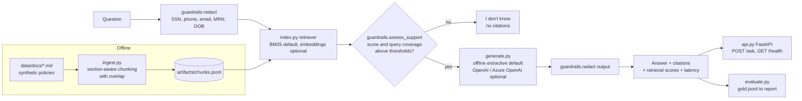

# Clinical RAG with Evaluation

[](https://github.com/veeranjanreddy-86/clinical-rag-eval/actions/workflows/ci.yml)

Retrieval-augmented question answering over clinical policy documents that cites its sources,
refuses when it lacks evidence, redacts PHI, and is measured against a gold set before release.

> Representative portfolio project built on synthetic data; not affiliated with or derived from
> any employer's code or data.

## Why this exists

Care teams (case managers, nurses, utilization reviewers) spend real time looking things up in
long policy and guideline documents: *How long is an imaging authorization valid? When must the
provider be notified after a fall?* A chat assistant could answer these questions, but in a
clinical setting an answer that sounds confident and is wrong costs more than no answer.

This project shows a way to build that assistant responsibly:

- **Grounded answers only.** Every answer sentence carries a citation to the document it came from.
- **Refuse instead of guessing.** If retrieval does not find enough supporting evidence, the
  service returns "I don't know" with no citation.
- **Evaluate before release.** A gold question set, including questions the corpus *cannot*
  answer, produces a report on retrieval quality, citation correctness, groundedness and refusals,
  and CI runs it on every change.

## Architecture



| Module | Responsibility |
|---|---|
| `ingest.py` | Load markdown, split by heading, word-window chunks with overlap, persist JSONL |
| `index.py` | `Retriever` protocol; pure-Python BM25; `EmbeddingRetriever` with pluggable `Embedder` |
| `generate.py` | `Generator` protocol; deterministic extractive generator; OpenAI-compatible chat generator |
| `guardrails.py` | PHI/PII regex redaction (input and output); evidence-based refusal |
| `pipeline.py` | Orchestration: redact, retrieve, check support, generate, redact |
| `evaluate.py` | Metrics and markdown report over a JSONL gold set |
| `api.py` | FastAPI service |
| `config.py` / `logging_utils.py` | `pydantic-settings` config from env; structured JSON logs |

## Features

- Pure-Python BM25 retriever with no model downloads and no network needed; an embeddings
  retriever (sentence-transformers or OpenAI) can be swapped in behind the same interface.
- Deterministic offline generator: answers are verbatim sentences from retrieved chunks, each with
  an inline `[doc-id]` citation. This makes tests and evaluation reproducible.
- Optional OpenAI / Azure OpenAI generator, built only when its environment variables are set.
  Citations that point to passages the model was not given are discarded.
- Two-signal refusal: the best chunk must clear a BM25 score threshold **and** contain at least
  40% of the query terms. The second check catches off-topic questions that share one rare word
  with the corpus (for example "CT scanner vendor").
- PHI/PII redaction on both the question and the answer. Logs record counts, ids and timings,
  never raw question or answer text.
- Evaluation harness: recall@k, MRR, citation precision, groundedness, refusal accuracy, false
  refusal rate and latency, written to `reports/eval_report.md`.

## Quickstart

Requires Python 3.11+.

```bash
make install   # creates .venv, installs runtime + dev deps
make test      # pytest
make lint      # ruff check + format check
make eval      # ingest + evaluation -> reports/eval_report.md
make run       # API on http://127.0.0.1:8000
```

CLI:

```bash
.venv/bin/python -m clinical_rag.cli ingest
.venv/bin/python -m clinical_rag.cli ask "How long is an approved imaging authorization valid?"
.venv/bin/python -m clinical_rag.cli eval
```

Docker (non-root user, uvicorn; the image ingests the synthetic corpus at build time):

```bash
docker build -t clinical-rag-eval .
docker run --rm -p 8000:8000 clinical-rag-eval
```

Configuration is read from environment variables or `.env`; see [`.env.example`](.env.example).
To use an LLM: `pip install -e .[llm]` and set `CRAG_GENERATOR=openai` with `OPENAI_API_KEY`, or
`CRAG_GENERATOR=azure_openai` with the `AZURE_OPENAI_*` variables.

## Example

```bash
curl -s -X POST localhost:8000/ask \
  -H 'content-type: application/json' \
  -d '{"question": "How long is an approved imaging authorization valid?"}'
```

```json
{
  "answer": "An approved imaging authorization is valid for 60 calendar days from the approval date. [prior-authorization-imaging]",
  "refused": false,
  "citations": [
    {
      "doc_id": "prior-authorization-imaging",
      "chunk_id": "prior-authorization-imaging#4",
      "title": "Prior Authorization Policy: Advanced Imaging"
    }
  ],
  "retrieval": [
    {"chunk_id": "prior-authorization-imaging#4", "doc_id": "prior-authorization-imaging", "score": 13.6778, "rank": 1},
    {"chunk_id": "prior-authorization-imaging#0", "doc_id": "prior-authorization-imaging", "score": 6.0879, "rank": 2},
    {"chunk_id": "skilled-nursing-transfer-faq#4", "doc_id": "skilled-nursing-transfer-faq", "score": 6.059, "rank": 3},
    {"chunk_id": "prior-authorization-imaging#3", "doc_id": "prior-authorization-imaging", "score": 4.6729, "rank": 4}
  ],
  "redactions": {},
  "latency_ms": 1.65
}
```

An unanswerable question that also contains an identifier
(`{"question": "What is the visitor parking fee? My MRN is 12345678."}`):

```json
{
  "answer": "I don't know. The indexed documents do not contain enough supporting evidence to answer this question.",
  "refused": true,
  "citations": [],
  "retrieval": [],
  "redactions": {"MRN": 1},
  "latency_ms": 0.16
}
```

## Evaluation results

Run on the bundled gold set: 25 questions, of which 20 are answerable and 5 are unanswerable.
Configuration: BM25, offline extractive generator, `top_k=4`, 80-word chunks with 20-word
overlap, `min_score=4.0`, `min_query_coverage=0.4`. Full per-question output is in
[`reports/eval_report.md`](reports/eval_report.md).

| Metric | Value |
|---|---|
| Recall@4 (answerable) | 1.000 |
| MRR (answerable) | 1.000 |
| Citation precision (answered) | 0.908 |
| Groundedness (answered) | 1.000 |
| Refusal accuracy (unanswerable) | 1.000 (5/5) |
| False refusal rate (answerable) | 0.000 (0/20) |
| Latency p50 / p95 | 0.56 ms / 0.68 ms (in-process, excluding HTTP) |

**How to read these numbers.** The corpus is small (11 documents, 59 chunks) and the questions
were written by the same author as the documents, so they share a lot of vocabulary with them.
That favors BM25, so read the retrieval scores as a regression baseline, not as evidence of
real-world performance. Groundedness is 1.0 *by construction* for the extractive generator,
because it copies sentences verbatim. The metric exists to catch an LLM generator drifting away
from its sources. Citation precision below 1.0 comes from answers that add a loosely related
sentence from a second document; see q02, q11, q17 and q20 in the report.

## Design decisions

- **BM25 first.** It is deterministic, fast and has no dependencies, and it handles policy text
  with distinctive terms well. It also gives the pipeline a baseline that any embedding or hybrid
  retriever has to beat on the same gold set before it replaces BM25.
- **Extractive by default.** An offline, deterministic generator makes CI meaningful: the
  evaluation measures retrieval and guardrails without LLM variance or cost. The LLM path uses
  the same interface and is evaluated with the same harness.
- **Refuse on weak evidence.** For care teams a wrong answer is worse than no answer. The refusal
  thresholds are explicit configuration that is reviewed with evaluation results, not hidden
  constants in code.
- **Redact on both sides.** The question is redacted before retrieval and logging, and the answer
  is redacted again in case a source document contains identifiers.
- **Interfaces over frameworks.** Small `Protocol` classes (`Retriever`, `Embedder`, `Generator`)
  keep the core easy to test with fakes, and they map cleanly onto LangChain/LlamaIndex components
  if a team adopts those tools.

## Security and privacy

- **Synthetic data only.** Every document is fictional ("Maple Ridge Health System") and marked
  `SYNTHETIC DOCUMENT`. None of it is real clinical guidance, and none of it contains patient data.
- **PHI redaction.** Regex patterns cover SSNs, phone numbers, email addresses, MRN-like
  identifiers and labelled dates of birth, on input and on output.
- **No secrets in the repo.** Credentials come from environment variables only; `.env` is
  gitignored and `.env.example` contains no values. Secrets are typed as `SecretStr`.
- **Minimal logging.** Logs are structured JSON with ids, scores, counts and latency. Question and
  answer text is never logged.
- The container runs as a non-root user. See [SECURITY.md](SECURITY.md).

## Limitations

- Regex redaction is not de-identification. It does not detect names, addresses or free-text
  identifiers; production use would need a dedicated PHI detection service and a compliance review.
- Lexical retrieval misses paraphrases and synonyms ("imaging approval" vs. "authorization").
- Extractive answers can be incomplete. For example, a two-part question may get only the
  sentence that matches it best. There is no reference-answer correctness metric yet.
- The refusal thresholds were chosen using this same gold set. There is no held-out split, so
  expect them to need re-tuning on a new corpus.
- The gold set is small (25 questions), so a single question moves a metric by 4-5 points.

## Roadmap

- Hybrid retrieval (BM25 + dense) with reciprocal rank fusion, and a cross-encoder reranker
- AWS Bedrock provider (generation and embeddings) next to Azure OpenAI
- LLM-judged faithfulness and answer correctness via RAGAS, alongside the current heuristics
- Larger gold set with paraphrased questions and a held-out split for threshold calibration
- NER-based PHI detection to complement the regex patterns

## License

[MIT](LICENSE) © 2026 Veeranjan Reddy
